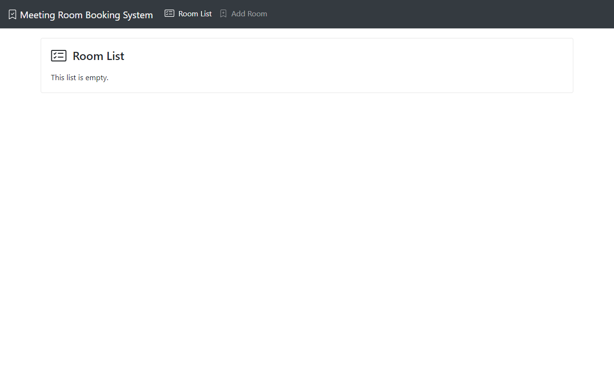
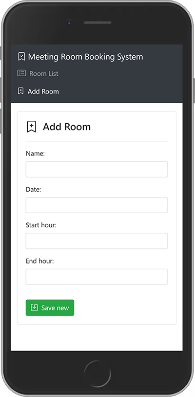

# Digital Innovation One

## Criando um gerenciador de salas de reuniões com Java e Angular

Neste projeto foram desenvolvidos uma API com Spring Boot para gerenciar as salas de reunião, com a utilização do Spring Data para persistência de dados e o banco in-memory H2. O Front-end que consome essa API é uma SPA escrita em Angular.

### 🖱 [Clique aqui para ver online.][angular-app]

---

### 📷 Screenshots






---

### 📑 Instruções

Digite o comando a seguir no diretório raiz para instalar todas as dependências do projeto:

```console
npm install
```

Execute o projeto digitando o comando a seguir:

```console
ng serve
```

---

### 📚 Referências

- [Angular](https://angular.io/docs)

[angular-app]:https://leonardosposina.github.io/dio-meeting-room-booking-system
